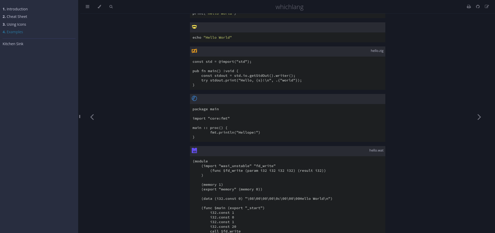
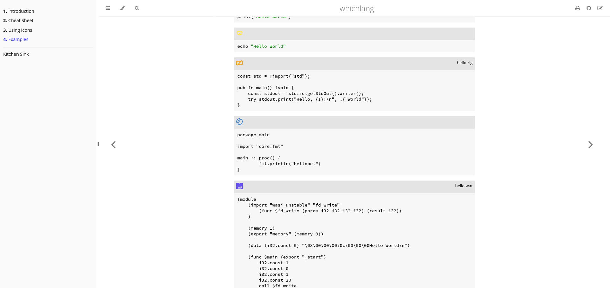

# whichlang - Powerful Code Blocks for mdBook




<!-- ANCHOR: description -->

- 🎨 Optimized for every theme.
- 🔥 Zero-Setup installation: Use the installer or download the standalone files from the repository.
- 🔧 Highly configurable.


## Installation

In the directory of your book, install _whichlang_ with the following command.

```console,lang=Console,icon=.devicon-bash-plain
curl -sSf https://raw.githubusercontent.com/phoenixr-codes/mdbook-whichlang/master/install.sh | sh
```

Alternatively, you can download `dist/whichlang.js` and `src/whichlang.css`
and save them in the appropiate directories within your book.

Don't forget to add these files in your `book.toml`:

```toml,lang=TOML,filepath=book.toml
# ...

[output.html]
additional-css = ["path/to/whichlang.css"]
additional-js = ["path/to/whichlang.js"]
```


## Uninstallation

Simply remove the `whichlang.js` and `whichlang.css` files and remove the references to them in the
`book.toml` configuration file.


## Usage

_whichlang_ works out of the box. It detects the language defined on each code block and customizes
them appropiately. You can furthermore configure them individually which is recommended:

- override the name of the language
- override the icon of the language
- set a file path shown in the code block

<!-- ANCHOR_END: description -->

You can see examples and more precise explainations in the [documentation].


## Contributing

See [Contributing](./CONTRIBUTING.md).
